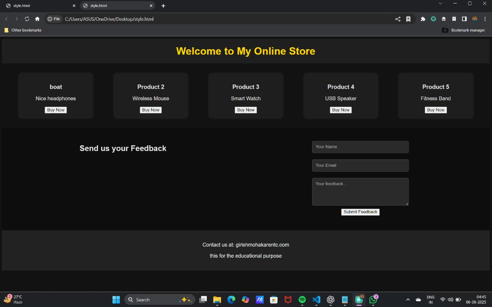

# 🛍️ My Online Store (HTML + CSS)

This is a basic dark-themed online store webpage created using HTML and CSS. It features a product listing section, a feedback form, and contact details in the footer.

---

# 🔧 Features

## ✅ Product Section

Displays multiple products in a responsive card layout.

Each product has a name, description, and a “Buy Now” button.

Styled with dark colors for a modern UI.

## ✅ Feedback Form

Allows users to submit their name, email, and feedback.

Styled input fields and a submit button with hover effects.

## ✅ Footer

Contact information and a disclaimer about educational purpose.

---

# 🎨 Technologies Used

HTML 5

CSS3 (with Flexbox for layout)

No external libraries or frameworks used

---

# 📝 Notes

This is a static page — the “Buy Now” and “Submit Feedback” buttons don’t perform any real actions.

It's ideal for beginners learning HTML & CSS, or as a UI prototype.

---
# screenshots 

# 📬 Contact

📧 Email: girishmohakarentc.com
🔖 Purpose: This website is built for educational purposes.
